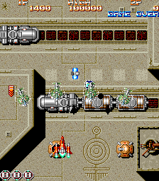

# Arcade-SandScrp_MiSTer

Sand Scorpion (FACE, 1992) for the MiSTer FPGA platform — a from-scratch
implementation of the Kaneko VIEW2 tilemap chip and PANDORA sprite generator,
built against MAME's `kaneko/sandscrp.cpp` — the driver by **Luca Elia** — as
the behavioural reference. See [Attribution](#attribution).

One `.rbf` serves all three sets: `sandscrp`, `sandscrpa` (earlier program)
and `sandscrpb` (*Kuai Da Shizi Huangdi*, revised hardware). They share one
machine configuration and, as the ROM audit confirms, byte-identical graphics
and sound data; only the 68000 program differs.

**Status: it boots and plays on real hardware.** Milestones 0 to 3 of
`docs/PLAN.md` are done and measured: the video path, the whole board, and the
whole board with every ROM byte coming out of a real SDRAM controller are each
verified pixel-exact against MAME, and savestates round-trip. Milestone 4 now
has a MiSTer top level that builds clean and **runs on a DE10-Nano** — title
screen, attract cycle, high-score table, and gameplay on coin, start and fire.
**All three sets have been swept on the board** and each boots, runs its
attract and plays.

Most of the OSD feature set has now been checked on the board too: DIP
switches, Flip screen (an exact 180-degree rotation), CRT Adjust, Pause, High
scores including the patch-the-`.nvm` proof, and savestate save, with savestate
load working but not on every attempt. Orientation cannot be observed with the
tools to hand, cheats are inconclusive and autofire is untested; audio against
MAME and a frame-level comparison with the reference simulation have not been
run on hardware either. See `docs/PLAN.md` for the plan,
`docs/hw-bringup.md` for milestone status, the build numbers and the bring-up
log, and `docs/known-issues.md` for what is measured, what is assumed and what
is still open.

## The board

| Part | Clock | Notes |
|---|---|---|
| TMP68HC000N-12 | 12 MHz | `fx68k` |
| Z8400AB1 (Z80A) | 4 MHz | `T80`; reads **both** DIP banks through the sound chip |
| YM2203C + Y3014B | 4 MHz | `jt03`; DSW1 on port A, DSW2 on port B |
| OKIM6295 | 2 MHz, pin 7 high | `jt6295` |
| VIEW2 | — | two 512x512 tilemaps of 16x16x4 tiles, per-row line scroll, 8 priority categories — **new RTL** |
| PANDORA (PX79C480FP-3) | — | 512 sprites drawn into a double-buffered 256x256 plane — **new RTL** |
| CALC1 | — | rectangle collision, 16x16 multiply, random — **new RTL** |

`clk_sys` is 48 MHz, which divides exactly into every clock on the board:
68000 /4, Z80 and YM2203 /12, OKI /24, pixel clock /8 = 6 MHz.

## Verification

Every claim here is a measurement; the method is in `docs/sim-harness.md`.

- **The whole board, run from reset with nothing preloaded, is pixel-exact
  against MAME**: **43 of 44** dumped frames match with zero differing pixels,
  through the boot sequence, the FACE logo animation and the title screen. The
  watchdog reboot the game needs in order to boot at all fires at the core's
  frame 180 against MAME's 179. The offset between the two timelines drifts, as
  two independently running machines do; held at the single best offset, 27 of
  43 still match exactly. The one frame that matches at no offset is a boot
  flash: the core renders one line ahead of the raster like the board, so a
  palette write during the visible area tears the frame, which MAME (rendering
  whole frames at vblank) never shows.
- **The same core with every ROM byte coming out of the real SDRAM controller
  is also pixel-exact against MAME**, and an exhaustive golden-byte audit walks
  all **3,801,088** bytes of every region through the real caches and the real
  controller with **0 wrong and 0 timeouts**.
- **Video: 61 of 61 frames identical to an independent model of MAME.** Each
  frame is rendered from a MAME state capture and compared three ways — the
  RTL, a Python transcription of MAME's own algorithms sharing no code with
  it, and MAME's own pixels. 31 of the 61 are additionally pixel-exact against
  MAME; the rest deviate identically in both renderers, because the game
  rewrites its sprite table 1,747 times per frame and no capture taken after
  MAME's own snapshot can reproduce it (`docs/known-issues.md` SS-3).
- Frames cover the title, the attract demo, the score table, gameplay with
  line scroll active, both layers disabled, and the Flip Screen DIP.
- **CALC1: 200,000 randomised cases against a transcription of MAME's own
  collision and multiply code, 0 mismatches**, including values straddling
  0x8000, sums that overflow 16 bits and deliberately equal coordinates.
- **Savestates round-trip.** Two images of the same state, one reached directly
  and one through a save and load, are diffed word for word: every region —
  work RAM, VIEW2 VRAM, palette, sprite RAM, Z80 RAM, the sound-chip shadow and
  the registers — comes back bit-identical, bar the two CPUs' own parked
  program counters.
- The seven unit tests inherited from the NMK16 project (SDRAM controller and
  arbiter, ROM caches, OKI cache, video retimer, CRT Adjust chain) all pass,
  alongside the CALC1 test written here.
- **Synthesis** (`quartus_map`, Cyclone V 5CSEBA6): 5,229 ALMs of 41,910 and
  1,829,062 block-memory bits of 5,662,720, with every array -- the sprite
  plane, both line buffers, all eight VRAM lanes, the palette, the work RAM --
  inferred as real M10K rather than flip-flops.

## Repository

    rtl/kaneko/        view2.sv, pandora.sv, kaneko_hit.sv, video_sandscrp.sv,
                       video_timing_sandscrp.sv          -- new RTL
    rtl/sandscrp/      sandscrp_core.sv    the board, including its savestate bus
                       sandscrp_rom_hw.sv  the SDRAM side: caches, arbiters, download
    rtl/               SDRAM controller, ROM caches, prefetch, video retimer,
                       CRT Adjust chain, cheats, savestates  -- from Arcade-NMK16_MiSTer
    sim/oracle/        the MAME capture script and bus tracer
    sim/rtl/           video_state    one frame of video from a MAME state dump
                       sandscrp       the whole board, plus the savestate engine
                       sandscrp_hw    the same core with real SDRAM underneath
                       kaneko_hit_test and the inherited unit tests
    tools/             .mra generator + load model, tile decoders, the reference
                       renderer, the frame gates, board scripts
    releases/          the three .mra files and the current .rbf
    SandScrp.sv        the MiSTer top level: CONF_STR, hps_io, PLLs, SDRAM,
                       the core, the video chain and the OSD features
    files_sandscrp.qip the file list. Add files here, never in the Quartus IDE
    SandScrp.qsf/.qpf/.sdc/.srf    the Quartus project

## Building the ROM images

The `.mra` files, the hardware-mode ioctl stream and the simulation ROM images
all come from **one table** in `tools/gen_sandscrp_mra.py`, so they cannot
disagree about where a region lives:

    python3 tools/gen_sandscrp_mra.py            # releases/*.mra
    python3 tools/gen_sandscrp_mra.py --check    # off-board load model
    python3 tools/gen_sandscrp_mra.py --simroms  # $readmemh images for the sims

## Building the core

Quartus Prime 17.0 Lite, the version the MiSTer framework in `sys/` targets.
The `.qsf` names the device (`5CSEBA6U23I7`) and sources `files_sandscrp.qip`
for everything else.

    export PATH=<quartus>/bin:$PATH
    quartus_sh -t sys/build_id.tcl SandScrp SandScrp      # build_id.v, jtag.cdf
    quartus_sh --flow compile SandScrp -c SandScrp

The bitstream lands in `output_files_sandscrp/SandScrp.rbf`, and a copy of the
current one is tracked as `releases/Arcade-SandScrp_<date>.rbf` so it can be
used without running Quartus. The date is the one `build_id.v` carries and the
OSD shows, so a bitstream on a board can be matched back to a build. A
DE10-Nano wants the `.rbf` in `/media/fat/_Arcade/cores/` and the `.mra` files
in `_Arcade/`.

The whole flow — synthesis, fit, assembly and timing — runs with **0 errors**
and closes timing on the default seed:

| | |
|---|---|
| Logic (ALMs) | 18,806 of 41,910 (45 %) |
| Registers | 26,338 |
| M10K blocks | 342 of 553 (62 %) |
| Block memory bits | 2,517,975 of 5,662,720 (44 %) |
| DSP blocks | 45 of 112 (40 %) |
| PLLs | 3 of 6 |
| Worst setup slack | +0.392 ns, on the framework's HDMI clock |
| Worst hold slack | +0.247 ns |

The core's own clocks are well clear of the critical path: `clk_ram` and
`CLK_VIDEO` (96 MHz) at +1.747 ns setup, `clk_sys` (48 MHz) at +4.055 ns.

The tracked `.rbf` is the build that boots and plays on a DE10-Nano. It is
still not a release: most of the OSD feature set has never been exercised on
hardware. See `docs/hw-bringup.md` for which gates that leaves open.

## Attribution

**The MAME driver is the reference this core was built against**, and the
debt is a large one. `kaneko/sandscrp.cpp` is **by Luca Elia**, who wrote the
Sand Scorpion driver and is its copyright holder; the Kaneko chip devices this
project reimplements in RTL are his too, with others: `kan_pand.cpp`, the
PANDORA sprite generator, by **Luca Elia and David Haywood**; `kaneko_tmap.cpp`,
the VIEW2 tilemaps, by **Luca Elia and David Haywood**; and `kaneko_hit.cpp`,
the CALC1 collision and protection chip, by **Luca Elia, David Haywood and
Stephane Humbert**. All four are BSD-3-Clause.

Every behavioural claim in this repository is measured against that code
running as MAME 0.289. Nothing here is copied from it — the RTL is written from
scratch and the Python reference renderer is a deliberately independent
transcription — but the memory map, the chip semantics, the sprite and tilemap
formats and the machine configuration were all read out of that driver first.
Without it this core would have been a matter of guesswork against a PCB.

Built on the MiSTer framework and on these cores, fetched by
`tools/bootstrap.sh` at the commits pinned in `deps.lock`: fx68k (Jorge Cwik),
T80 (Daniel Wallner lineage, MiSTer-devel), jt12/jt03 and jt6295 (Jose
Tejada), the MiSTer hiscore module (Alan Steremberg, Jim Gregory) and CRT
Adjust (Umberto Parisi). The SDRAM controller, the hiscore module and
`crt_vsize` carry local modifications, described in `deps.lock`.

Sand Scorpion is © 1992 FACE. No ROM data is included in this repository.
